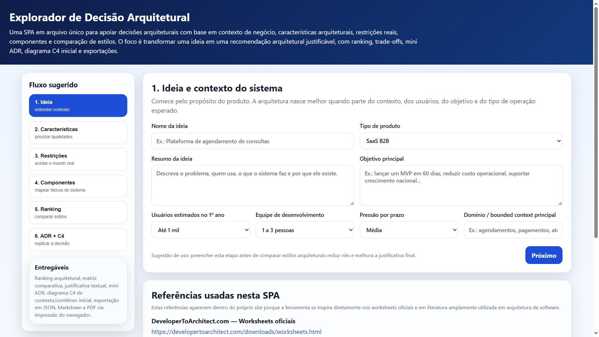

# exploradordearquiteturadesoftware
Uma SPA (Single Page Application) em arquivo único para apoiar decisões arquiteturais com base em contexto de negócio, características arquiteturais, restrições reais, componentes e comparação de estilos. O foco é transformar uma ideia em uma recomendação arquitetural justificável, com ranking, trade-offs, mini ADR, diagrama C4 inicial e exportações.

Referências usadas nesta SPA (todos os direitos autorais são de seus respectivos autores):

Estas referências aparecem dentro do próprio site porque a ferramenta se inspira diretamente nos worksheets oficiais e em literatura amplamente utilizada em arquitetura de software.

DeveloperToArchitect.com — Worksheets oficiais
https://developertoarchitect.com/downloads/worksheets.html

Mark Richards — Architecture Styles Worksheet
Base para a comparação entre layered, modular monolith, microkernel, microservices, service-based, service-oriented, event-driven e space-based.

Mark Richards — Architecture Characteristics Worksheet
Base para priorização de características arquiteturais, incluindo observabilidade, disponibilidade, testabilidade, elasticidade, interoperabilidade, abstração, integridade e consistência de dados.

Fundamentals of Software Architecture — Mark Richards e Neal Ford

Software Architecture in Practice — Bass, Clements e Kazman

Documenting Software Architectures — Clements e colaboradores

C4 Model — Simon Brown

Architecture Decision Records (ADR) — prática consolidada de registro de decisões arquiteturais

Ferramenta criada na disciplina Arquitetura de Software Avançado do MPES/Cesar School em 28/03/2026.

